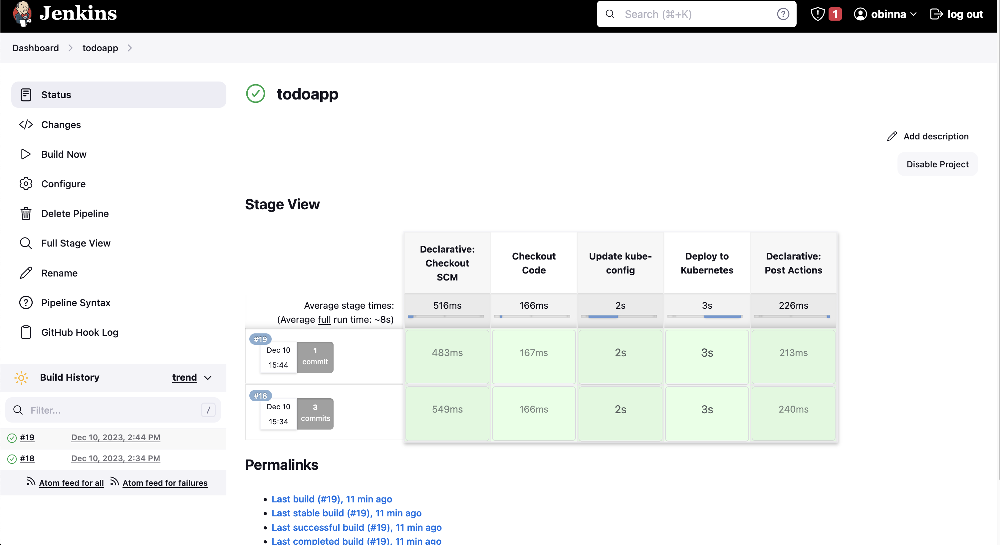

## Jenkins Server Setup

1. **Open Port 8080:**
   Ensure that port 8080 is open on your Jenkins server to allow access to the Jenkins web interface. You can use a firewall management tool like `ufw` to open the port:
   ```bash
   sudo ufw allow 8080
   ```

   Make sure to configure any security groups or firewalls in your infrastructure to allow incoming traffic on port 8080.

## AWS CLI Installation

Follow the official AWS CLI documentation for detailed instructions on installing the AWS CLI on your server or development machine:

- [AWS CLI Getting Started](https://docs.aws.amazon.com/cli/latest/userguide/getting-started-install.html)

This guide provides step-by-step instructions for different operating systems.

## Jenkins-GitHub Webhook Configuration

To set up a Jenkins webhook with GitHub for automatic triggering of builds upon code changes:

1. **Jenkins Configuration:**
   - In Jenkins, navigate to your job's configuration page.
   - Under the "Build Triggers" section, select "GitHub hook trigger for GITScm polling."

2. **GitHub Webhook Configuration:**
   - In your GitHub repository, go to "Settings" > "Webhooks" > "Add webhook."
   - Set the "Payload URL" to: `http://3.81.235.160:8080/github-webhook/`
   - Set "Content type" to `application/json`.
   - Choose the events you want to trigger the webhook.
   - Save the webhook.

Ensure that Jenkins is accessible from the GitHub server, and the GitHub webhook is properly configured to send events for the desired repositories.

## Packer AMI Reference

If you're using Packer to create an Amazon Machine Image (AMI) and need to filter for a specific source AMI, refer to the following Stack Overflow post:

- [Packer Builder Source AMI Filter for Ubuntu 18.04](https://stackoverflow.com/questions/62426904/packer-builder-source-ami-filter-for-ubuntu-18-04)

This reference provides guidance on filtering source AMIs when using Packer to build an AMI for Ubuntu 18.04. Ensure you customize the filter parameters according to your specific requirements.

Please replace the placeholder URLs with your actual Jenkins server IP and any specific documentation relevant to your setup. Additionally, follow security best practices for Jenkins, GitHub, and AWS environments to ensure a secure and reliable CI/CD pipeline.
# CI/CD Jenkins Pipeline Project

This Jenkins pipeline automates the Continuous Integration and Continuous Deployment (CI/CD) process for a project hosted on GitHub. The pipeline includes stages for checking out code from GitHub, updating the kube-config for an Amazon EKS (Elastic Kubernetes Service) cluster, and deploying the application to Kubernetes. Additionally, it integrates with Slack to notify about pipeline success or failure.

## Prerequisites

Before running the Jenkins pipeline, ensure the following prerequisites are met:

- **AWS Credentials:** AWS access key ID and secret access key are required. These credentials are securely stored in Jenkins using the AWS_ACCESS_KEY_ID and AWS_SECRET_ACCESS_KEY credentials.
- **Jenkins Slack Integration:** Slack notifications are sent using the SlackSend step. Ensure that the Jenkins instance is configured with the necessary Slack credentials (SLACK_TOKEN) and the Slack channel is set appropriately.

## Pipeline Overview

The Jenkins pipeline consists of the following stages:

1. **Checkout Code:**
    - **Description:** Clones the project code from the GitHub repository.
    - **Script:**
        ```groovy
        echo "Checking out code from GitHub"
        // git 'https://github.com/obinnaaliogor/cicd-jenkinspipeline.git'
        ```

2. **Update kube-config:**
    - **Description:** Updates the kube-config file to interact with an Amazon EKS cluster.
    - **Script:**
        ```groovy
        sh 'aws eks update-kubeconfig --name demo --region us-east-1'
        ```

3. **Deploy to Kubernetes:**
    - **Description:** Applies Kubernetes manifests to deploy the application.
    - **Script:**
        ```groovy
        sh 'kubectl config current-context'
        sh 'kubectl apply -f k8s-manifests/'
        ```

4. **Post-build Actions:**
    - **Success Notification:**
        - **Description:** Sends a success notification to Slack channel #buildstatus-jenkins-pipeline.
        - **Script:**
            ```groovy
            slackSend(
                channel: "#buildstatus-jenkins-pipeline",
                color: 'good',
                message: "Pipeline succeeded for ${env.JOB_NAME} ${env.BUILD_NUMBER}: ${env.BUILD_URL}"
            )
            ```

    - **Failure Notification:**
        - **Description:** Sends a failure notification to Slack channel #buildstatus-jenkins-pipeline.
        - **Script:**
            ```groovy
            slackSend(
                channel: "#buildstatus-jenkins-pipeline",
                color: 'danger',
                message: "Pipeline failed for ${env.JOB_NAME} ${env.BUILD_NUMBER}: ${env.BUILD_URL}"
            )
            ```

## How to Run the Pipeline

1. Ensure Jenkins is installed and configured.
2. Configure AWS credentials in Jenkins with the IDs `AWS_ACCESS_KEY_ID` and `AWS_SECRET_ACCESS_KEY`.
3. Configure Slack credentials in Jenkins with the ID `my-lack` (assumed from your commented code).
4. Create a new pipeline job in Jenkins.
5. Configure the pipeline job to use the Jenkinsfile from the specified GitHub repository (e.g., `https://github.com/obinnaaliogor/cicd-jenkinspipeline.git`).

## References

- [Jenkins](https://www.jenkins.io/)
- [AWS CLI Documentation](https://docs.aws.amazon.com/cli/latest/userguide/cli-configure-files.html)
- [Jenkins Slack Integration Plugin](https://plugins.jenkins.io/slack/)
- [Amazon EKS Documentation](https://docs.aws.amazon.com/eks/latest/userguide/getting-started.html)

## Executing the shell script.

```bash
chmod +x terraform_script.sh
./terraform_script.sh apply
# or
./terraform_script.sh destroy
